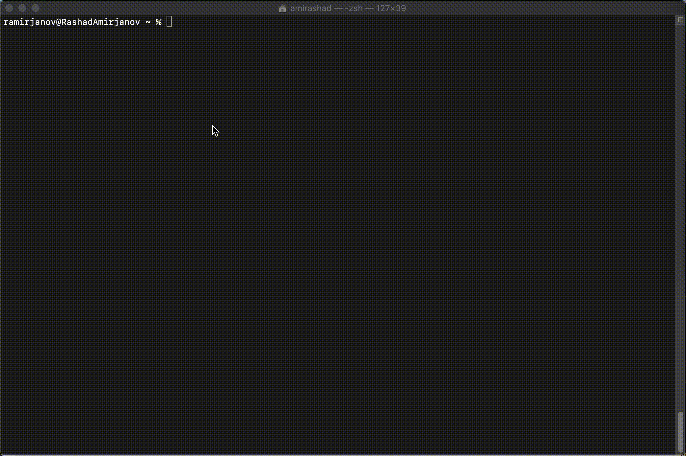

# ghctl
[](https://github.com/amirashad/ghctl/releases)
[](https://bestpractices.coreinfrastructure.org/projects/3272)
[](https://circleci.com/gh/amirashad/ghctl)
[](https://sonarcloud.io/dashboard?id=amirashad_ghctl)
[](https://hub.docker.com/r/amirashad/ghctl/)
<!-- [](https://snyk.io/test/github/amirashad/ghctl) -->

a lightweight and portable command-line GitHub repository management tool

The aim of the project is to be automatize the creation of repositories with yaml files.

## Why ghctl is needed?

GitHub is a great version control system. For creating repositories with branch protection, adding some mandatory reviewers to repo is tedious. Additionally if your organisation works with microservices or serverless architecture, it means that every day you will create repo. 

To automatize this kind of issues ghctl will help you apply your yaml configuration of repo and create repo with some pipeline. 

**`ghctl`** helps you create repository from command-line:


## Installation

You can download the binary built for your architecture from [the latest release](https://github.com/amirashad/ghctl/releases/latest). 

<details open><summary><strong>macOS</strong></summary><p>

The following is an example of installation on macOS:

```console
$ curl https://github.com/amirashad/ghctl/releases/download/v0.5.0/ghctl_darwin_amd64 -L -o /usr/local/bin/ghctl
$ chmod +x /usr/local/bin/ghctl
```

</p></details>

<details><summary><strong>Linux</strong></summary><p>

For Linux based OS, you can use following oneliner to download latest binary for AMD64 architecture.
```console
$ curl -L "$(curl -Ls https://api.github.com/repos/amirashad/ghctl/releases/latest | grep -o -E "https://.+?_linux_amd64")" -o /usr/local/bin/ghctl && chmod +x /usr/local/bin/ghctl 
```

</p></details>

<details><summary><strong>Windows</strong></summary><p>

For Windows OS, you can use following PowerShell command to download binary for AMD64 architecture.
```
Invoke-WebRequest https://github.com/amirashad/ghctl/releases/download/v0.5.0/ghctl_windows_amd64.exe -O ghctl.exe
```

</p></details>

### Docker

You can also use [ghctl via Docker](https://hub.docker.com/r/amirashad/ghctl/).

```console
$ docker run --rm -v $(pwd):/data -t amirashad/ghctl
```

You can use this image to automatize repo creation with CI/CD tools like Travis CI, CircleCI. `curl` and `yq` was preinstalled to image. 

## Features

 - Apply with yaml file or with cli args
 - Create repository
 - Create branch on repository
 - Create protection on branch
 - Add mandatory reviewers to branch protection
 - Add required checks to branch protection
 - Add some files to repository, branch
 - Get repositories of organisation as yaml or json
 - Get repository by name as yaml or json
 - Get members of organisation as yaml or json
 - Get teams of organisation as yaml or json

## Limitations

ghctl currently only manages repositories.

## Usage

1) ghctl to work properly should set environment variable `GITHUB_TOKEN` and `GITHUB_ORG` or specify as command-line argument `--token` and `--org` appropriately.

To get more help:
```
$ ghctl --help
Usage: ghctl [OPTIONS] [COMMANDS] [FILE]

OPTIONS:
      --token                                   GitHub token
      --org                                     GitHub organisation
      --version                                 Display version and exit
  -o, --outputformat=[normal|json|yaml]         Output format (default: normal)
  -v, --verbose,                                Show debug output (default: false)
  -h, --help,                                   Display this help and exit

COMMANDS:
  get
    repos
    members
    teams
  create
    repo
    branch
    protection
  add
    file
    collaborator
    team
  update
    repo
    branch
    protection
  apply
```

2) Create yaml file with needed configurations. For example, create repo.yml with following content

```yaml
github:
  repo:
    name: << Repository name >>
    description: << Repository description >>
    homepage: 
    private: false
    defaultBranch: develop
    onCreate:
      autoInit: true
      gitignore: Java
      license: null
    pages:
      issues: true
      projects: true
      wiki: true
    merge:
      allowMergeCommit: true
      allowSquashMerge: true
      allowRebaseMerge: true
    teams:
      team-developers: push
      team-admins: admin
    branches:
    - name: develop
      minApprove: 2
      codeOwners: true
      includeAdmins: true
      requiredStatusChecks:
        requiredBranchesUpToDate: true
        contexts:
        - 'ci/circleci: validate_code'
        - 'ci/circleci: validate_infra'
      push:
        users:
        - << Github username which has access to push to this branch >>
        teams: []
    - name: master
      minApprove: 1
      codeOwners: true
      includeAdmins: true
      requiredStatusChecks:
        requiredBranchesUpToDate: true
        contexts:
        - 'ci/circleci: validate_code'
        - 'ci/circleci: validate_infra'
        - 'ci/circleci: security_checks'
      push:
        users:
        - << Github username which has access to push to this branch >>
        teams: []
```

3) Apply script
```console
$ ghctl apply -f repo.yml
```

## Examples

 - [CircleCI example for automation of repo creation](examples/)

<!-- See [User guide](docs/guides) for each option. -->

## Exit Statuses

ghctl returns the following exit statuses on exit:

- 0: No issues found
- 1: Errors occurred

## FAQ
### Does ghctl create projects?
- No. ghctl not yet supports project creation.

## Debugging

If you don't get the expected behavior, you can see the detailed logs when running with `--verbose` flag.

```console
$ ghctl create repo --name my-repo --verbose
```

<!-- 
## Developing

See [Developer guide](docs/DEVELOPING.md). 
-->